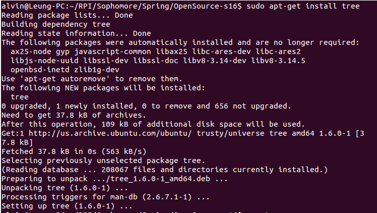
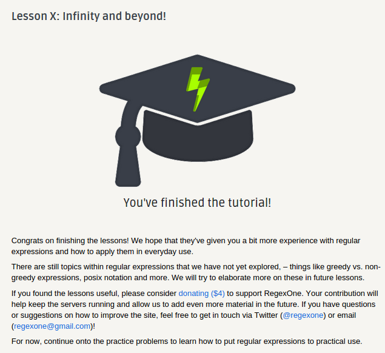

## Lab 1

Today I learned what it means for a program to be open source. For a program to be open source, it must allow distribution of the source code and any derived works. The program must also not discriminate against any persons or field of endeavors. It must not restrict against any other software either.

When asking questions on a forum, you should always try to find the answer first. You should also be precise about what you did and what went wrong, and if possible describe how to reproduce the problem. Also, you should make sure to spell correctly and use correct grammar.

Installing tree:

RegExp:

