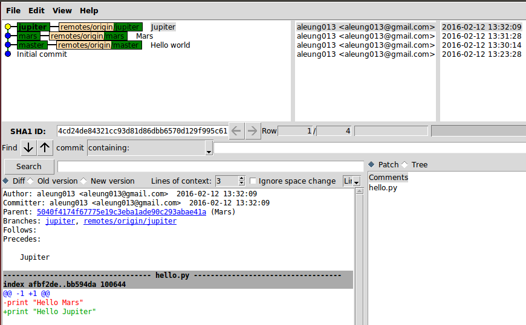
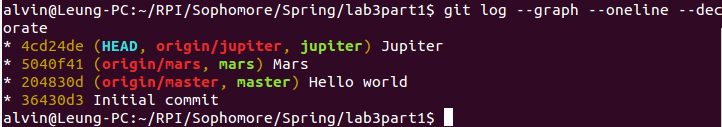

##Part 1
[Link](https://github.com/aleung013/lab3part1) to lab3part1

Using gitk:

Using git log:

##Part 2
[Link](https://github.com/aleung013/Spoon-Knife) to Spoon-Knife

Finished git branching:

#Part 3
Git diff shows us what has changed between the working directory and index/HEAD.

