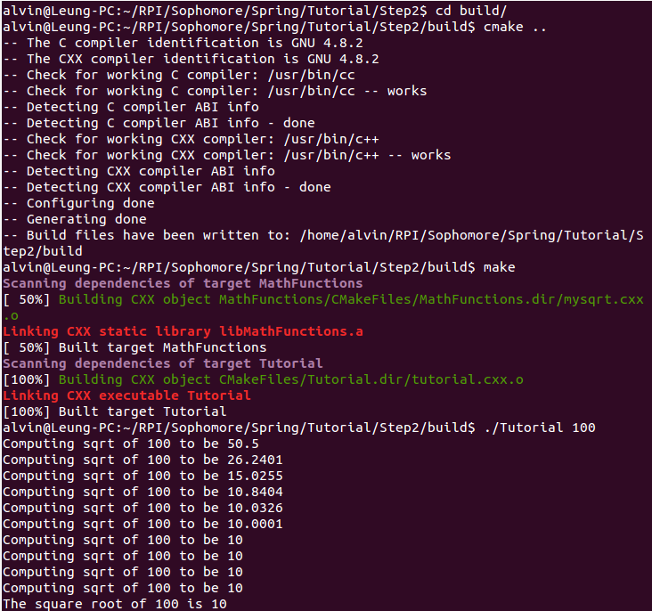

## Lab 5

[Link to code](https://github.com/aleung013/OpenSource-s16/tree/master/lab5/Tutorial)

#### Part 1
Running cmake and building the project:

#### Part 2
Adding a library:

### Part 3
Adding the install and tests:

### Part 4
Ading system introspection:

### Part 5
Adding generator:

