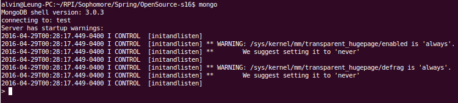

## Lab 9

### Checkpoint 1:
Running mongod:

Running mongo:

### Checkpoint 2:
Mongoimport:

### Checkpoint 3:
- db.definitions.find() returns all entries in the collection
- db.definitions.findOne() returns the first entry in the collection
- db.definitions.find({word:"Capitaland"}) returns all entries that match the given pattern word:"Capitaland"
- db.definitions.find({_id: ObjectId("56fe9e22bad6b23cde07b8ce")}) returns the entry that matches the given ObjectId

Inserting a word into the database:

[Link](https://github.com/raymondjacobson/csci2963_mongodb_lab/pull/18) to Pull Request

### Checkpoint 4
[Code](https://github.com/aleung013/csci2963_mongodb_lab/blob/master/checkpoint4.py) for checkpoint 4